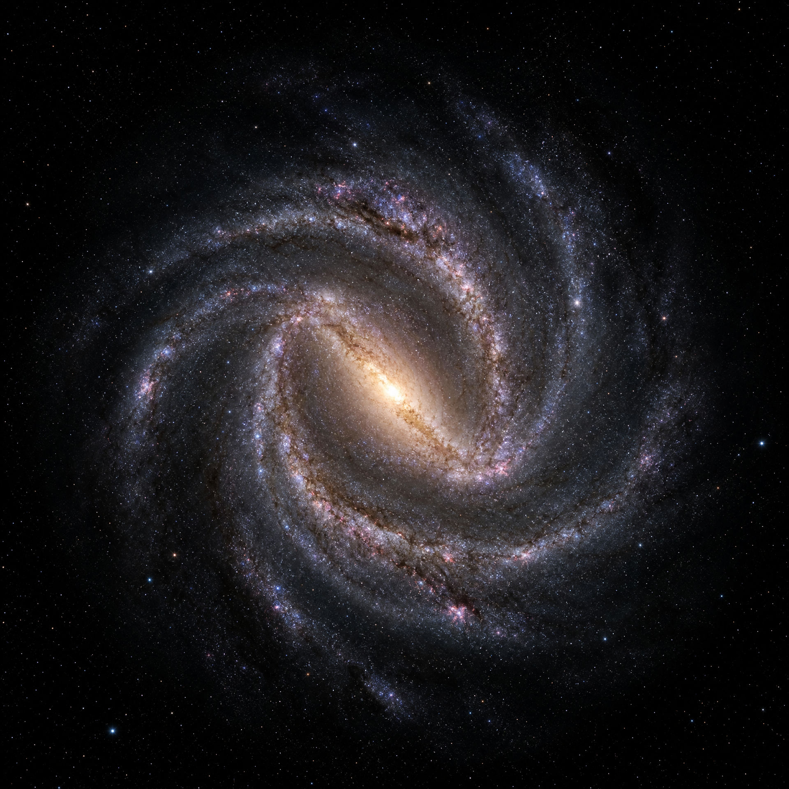

# OrbitLab

### A living, visual study of the Solar System

[](https://vercel.com/new/clone)
[](https://threejs.org/)
[](LICENSE)



OrbitLab is an interactive 3D Solar System experience built for exploration. It combines textured planets, a bright Sun, a spinning Moon, a prominent asteroid belt, Pluto, elliptical orbital paths, a zoom-triggered Milky Way, and a focused cinema mode in one fluid browser scene.

> Drag to orbit. Scroll or use the camera buttons to zoom. Zoom far enough out to reveal the animated Milky Way around the Solar System.

## What makes OrbitLab special

| Experience | Description |
| --- | --- |
| **Detailed Solar System** | Textured planets, Sun glow, Saturn’s rings, Earth’s Moon, Pluto, labels, and visible orbital paths. |
| **Physics-inspired motion** | Planet revolution rates follow relative orbital periods, while orbital paths use eccentricity, inclination, and periapsis data rather than perfect circles. |
| **Asteroid belt** | A dense, animated belt sits in the visual gap between Mars and Jupiter with clear separation from both planetary paths. |
| **Two-scale navigation** | Explore the Solar System up close, then zoom out into a detailed animated Milky Way scene. |
| **Cinema mode** | Use **Solar system only** to hide the interface and focus entirely on the animated scene. Press `Esc` or use the in-scene exit control to return. |
| **Tunable simulation** | Adjust time scale, per-planet revolution speed, orbit radius, and planet size without losing the default reset state. |
| **Refresh-safe rendering** | A loading gate, mipmaps, anisotropic filtering, high-density rendering, and detailed sphere geometry keep the scene crisp while assets load. |

## Controls

| Control | Behavior |
| --- | --- |
| **Pause simulation** | Stops or resumes the elapsed-time animation. |
| **Time scale** | Applies a global multiplier to the motion of planets, Moon, and asteroids. |
| **Zoom − / +** | Moves the camera out or in using the same limits as scroll and touch zoom. |
| **Orbit paths** | Shows or hides the elliptical orbital paths. Enabled by default. |
| **Asteroid belt** | Shows or hides the animated belt. |
| **Labels** | Shows or hides object labels. |
| **Reset defaults** | Restores revolution speeds, orbit radii, and planet sizes. |
| **Solar system only** | Enters a clean full-screen/cinema view with the interface hidden. |

## Orbital model

OrbitLab uses a visual scale with Earth at `1 AU = 70 scene units`. The motion model uses relative sidereal periods normalized to Mercury, and orbital paths are generated as ellipses using the eccentric anomaly solution of Kepler’s equation.

The scene includes approximate orbital characteristics for the displayed planets and Pluto, including orbital eccentricity and inclination. Visual body sizes are intentionally enhanced for readability in an interactive scene; the orbital relationships and relative motion are the focus of the model.

References: [NASA Solar System Exploration](https://solarsystem.nasa.gov/planets/overview/), [NASA Pluto Facts](https://science.nasa.gov/dwarf-planets/pluto/).

## Run locally

OrbitLab is a dependency-light static site. No build step is required.

```bash
git clone https://github.com/Samarssj/OrbitLab.git
cd OrbitLab
python3 -m http.server 4173
```

Open [http://localhost:4173](http://localhost:4173) in a modern browser. Serving the project over HTTP rather than opening `index.html` directly ensures that ES modules and local assets load correctly.

## Deploy to Vercel

OrbitLab is configured as a static Vercel project through [`vercel.json`](vercel.json).

### Dashboard deployment

1. Open [Vercel](https://vercel.com/new) and import `Samarssj/OrbitLab`.
2. Select **Other** as the framework preset.
3. Leave the build command empty.
4. Set the output directory to `.`.
5. Deploy.

### CLI deployment

```bash
npm i -g vercel
vercel
```

When prompted, keep the project as a static site and use the repository root as the output directory. The included configuration adds clean URLs and immutable caching headers for the visual assets while allowing JavaScript and CSS updates to roll out normally.

## Project structure

```text
OrbitLab/
├── index.html              # Interface shell and simulation controls
├── style.css               # Dark-space visual system and responsive layout
├── js/
│   └── main.js             # Three.js scene, controls, physics-inspired motion
├── img/                    # Planet, space, galaxy, and ring textures
└── vercel.json             # Static deployment and asset-cache configuration
```

## Built with

- [Three.js](https://threejs.org/) for the 3D scene, materials, lighting, camera, and animation.
- [OrbitControls](https://threejs.org/docs/#examples/en/controls/OrbitControls) for smooth interactive navigation.
- [Firebase Firestore](https://firebase.google.com/docs/firestore) for optional setup persistence.
- Native HTML, CSS, and JavaScript modules for a lightweight static deployment.

## Notes

OrbitLab is designed as an educational and visual exploration rather than a scale-perfect astronomical simulator. Planet diameters are exaggerated so bodies remain readable, while orbital ordering, relative periods, eccentricity, inclination, belt placement, and Pluto’s outer-system position are represented for an intuitive spatial experience.

## License

This project is released under the MIT License. Add a `LICENSE` file before publishing if you want the license badge above to resolve directly in the repository.
